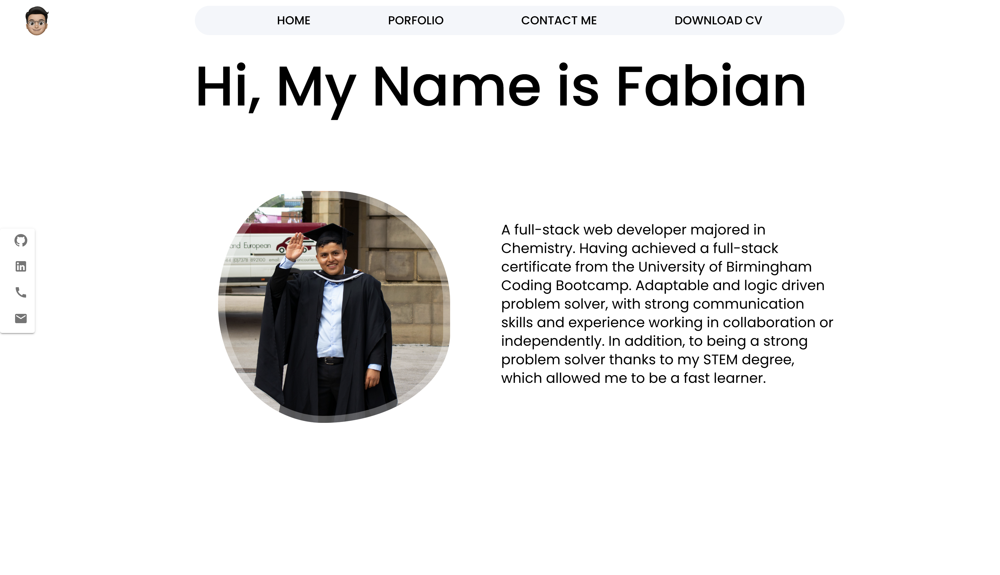
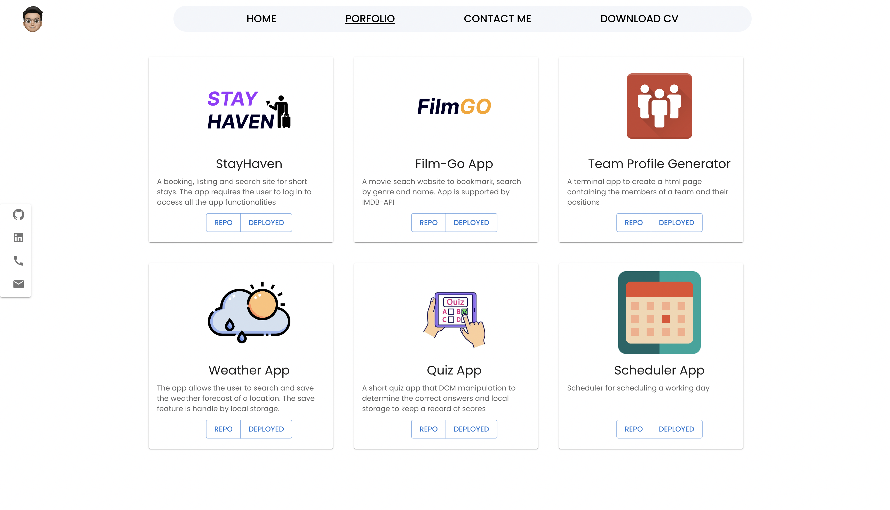
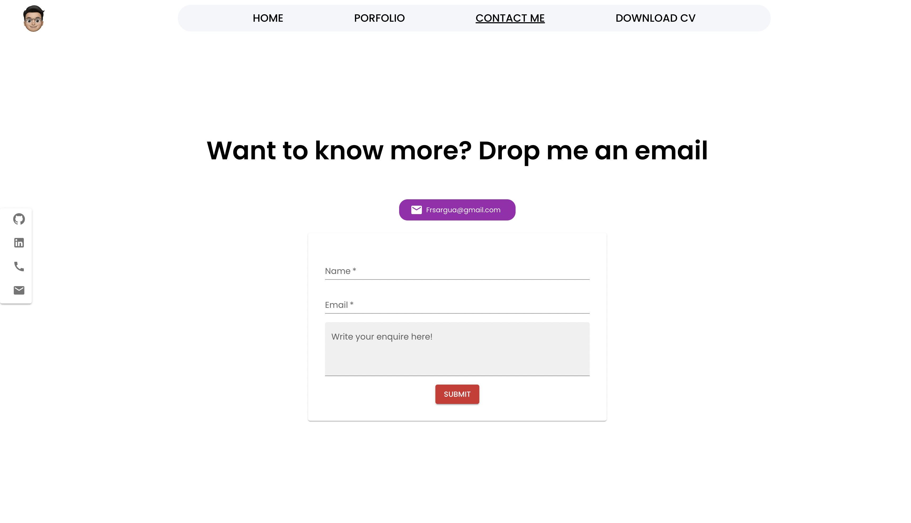

# Porfilio-React

## links

- [Live deploy](https://frsargua.github.io/Porfolio-React/#)
- [Repository](https://github.com/frsargua/Porfolio-React)

# Table of Contents

- [Description](#description)
- [Installation](#Installation)
- [Usage](#Usage)
- [License](#License)
- [Contributing](#Contributing)
- [Tests](#Tests)
- [Questions](#Questions)

## Description

This app showcases the projects that i have worked on. This app was created with React and MaterialUI.

## Installation

Once the repository has been cloned to your local repository follow the instructions below:

```
cd /PORFOLIO-REACT/PORFOLIO
npm install
```

## Usage

Inside the Porfolio folder

Type the following command to run the app:

```
npm run start
```

### Landing Page



### Porfolio page



### Contact-Me



# License

This project is not covered by a license.

## Contributing

## Tests

No tests available for this task.

## Questions:

GitHub: https://github.com/frsargua

email: frsargua@gmail.com
